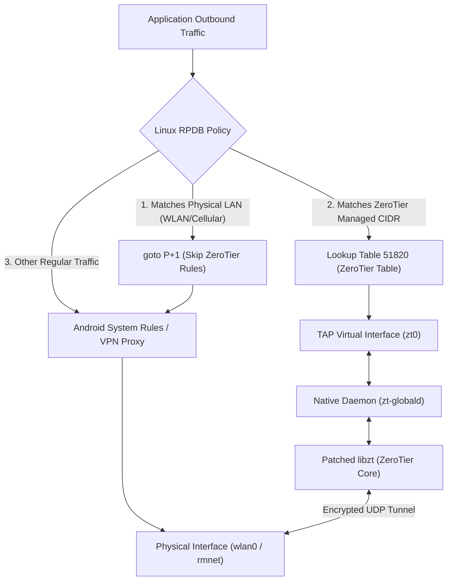

<div align="center">

# ZeroTier libzt Global Route

**High-Performance Native Global Policy Routing Module for Rooted Android Environments**

Connect to ZeroTier networks **without occupying Android's `VpnService` slot** — allowing coexistence with proxy/VPN tools!

[](https://github.com/Sivon/zerotier-libzt-global/releases)
[](https://android.com)
[](#-requirements)
[](#-requirements)
[](src/)
[](webui/)

[English](README.md) | [简体中文](docs/README_ZH_CN.md)

</div>

---

## ✨ Key Features

- ⚡ **Zero VPN Conflicts**: Routes ZeroTier managed CIDRs using Linux Routing Policy Database (RPDB) and an isolated routing table (default `51820`). Does not occupy Android's `VpnService` slot, coexisting seamlessly with any proxy or VPN apps.
- 🛡️ **Underlay Protection**: Dynamically monitors physical networks (WLAN / Mobile) via rtnetlink and injects a `goto / nop` bypass band into RPDB, preventing subnet overlaps from disrupting Wi-Fi or ADB connections.
- 🚫 **Anti Full-Tunnel Hijack**: Uses an internal prefix trie to inspect all routes, systematically rejecting `/0`, `/1`, or combined prefixes that attempt to swallow global traffic.
- 🎨 **Modern WebUI**: Built with SolidJS for KernelSU and APatch manager, supporting fluid touch gestures and system dark/light mode themes.
- 🪐 **Custom Planet & Transactional Rollback**: Supports chunked uploading of custom `planet` binaries. Automatically rolls back to the previous Planet if the daemon fails to initialize within 35 seconds.
- 🔑 **Cryptographic Identity Self-Healing**: Validates Ed25519 / C25519 key pairs and maintains secure backups to prevent Node ID churn across reboots.
- 🌐 **L2 Multicast & Broadcast Sync**: Synchronizes kernel multicast memberships with ZeroTier Core for native local discovery without altering or polluting Android DNS.

---

## 🏗️ System Architecture



---

## 📱 Requirements

- **Operating System**: Android 7.0+ (API Level 24+)
- **Architecture**: `arm64-v8a` (64-bit kernel and userspace)
- **Root Solutions**: [Magisk](https://github.com/topjohnwu/Magisk) v24.0+ / [KernelSU](https://github.com/tiann/KernelSU) v0.6.0+ / [APatch](https://github.com/bmax121/APatch)
- **Kernel Support**: Linux Universal TUN/TAP driver (`/dev/net/tun` with TAP support)

---

## 🚀 Quick Start

### 1. Installation
Download the latest `zerotier-libzt-global-<version>.zip` from [Releases](../../releases), flash it in Magisk / KernelSU / APatch manager, and reboot your device.

### 2. Configuration & Startup

#### Option 1: WebUI (Recommended, KernelSU / APatch)
Open the module's **WebUI** in your root manager:
- **Overview**: View connection state, assigned ZeroTier IPs, and active interfaces.
- **Network**: Enter your 16-character **Network ID**. Optionally upload a custom `planet` or reset to official Planet.
- **Routing**: Adjust rule priority (`auto` recommended) and routing table ID.

#### Option 2: CLI & Configuration File
```sh
# Save settings (replace with your 16-character hexadecimal Network ID)
su -c /data/adb/modules/zerotier-libzt-global/zt-globalctl save true "17d709436cxxxxxx" auto 51820 1400 0

# Restart daemon
su -c /data/adb/modules/zerotier-libzt-global/zt-globalctl restart

# Check runtime status
su -c /data/adb/modules/zerotier-libzt-global/zt-globalctl status
```

---

## ⚙️ Configuration Reference

File path: `/data/adb/zt-global/config.ini`

```ini
# Operational toggles and interface
enabled=true
interface=zt0
route_mode=managed
rule_priority=auto
routing_table=51820
mtu=1400

# 16-character hexadecimal ZeroTier Network ID
network_id=

# Root server and storage paths (defaults recommended)
planet_path=/data/adb/zt-global/planet
roots_path=/data/adb/zt-global/roots
storage_path=/data/adb/zt-global/state
port=0
```

| Parameter | Default | Description |
| :--- | :---: | :--- |
| `enabled` | `true` | Auto-start daemon on boot (`true` / `false`) |
| `network_id` | *(empty)* | 16-character hexadecimal ZeroTier Network ID |
| `route_mode` | `managed` | Routing mode: fixed to `managed` (routes controller subnets only) |
| `rule_priority`| `auto` | RPDB rule priority: `auto` (higher priority than VPN) or custom `2–32764` |
| `routing_table`| `51820` | Dedicated Linux routing table ID for ZeroTier routes |
| `mtu` | `1400` | TAP virtual interface MTU (range 1280 ~ 2800) |
| `port` | `0` | Local UDP listening port (`0` for random dynamic port) |
| `storage_path` | `.../state`| Storage path for identity keys and state data |

---

## 🛠️ Building from Source

### Prerequisites
- **Host OS**: macOS or Linux
- **Android NDK**: NDK r25+ (`export ANDROID_NDK_HOME=/path/to/ndk`)
- **Toolchain**: CMake 3.22+, Ninja, Node.js 18+, npm

### Build & Package
```sh
# 1. Clone repository with submodules
git clone --recurse-submodules https://github.com/Sivon/zerotier-libzt-global.git
cd zerotier-libzt-global

# 2. Build patched libzt library
./scripts/build_libzt.sh

# 3. Build native C++ daemon (zt-globald)
./build.sh

# 4. Build WebUI assets
(cd webui && npm run typecheck && npm run build)

# 5. Package flashable ZIP module
./scripts/package.sh
```

The resulting package is written to `../output/zerotier-libzt-global-<version>.zip`.
