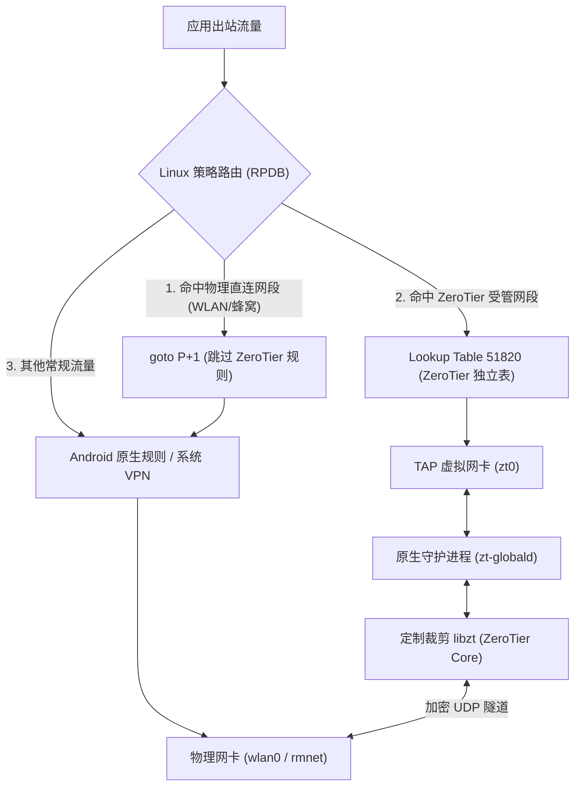

<div align="center">

# ZeroTier libzt Global Route

**面向 Android Root 环境的高性能 ZeroTier 原生全局策略路由模块**

无需占用 Android `VpnService` 槽位，与 VPN 客户端**完美共存**

[](https://github.com/Sivon/zerotier-libzt-global/releases)
[](https://android.com)
[](#-系统要求)
[](#-系统要求)
[](src/)
[](webui/)

[简体中文](README.md) | [English](README_EN.md)

</div>

---

## ✨ 核心特性

- ⚡ **VPN 零冲突**：基于 Linux 策略路由 (RPDB) 和独立路由表（默认 `51820`）将 ZeroTier 受管网段精准分流，绝不占用系统 `VpnService` 槽位，与各类代理 VPN 客户端完美共存。
- 🛡️ **底层网络保护 (Underlay Protection)**：动态监听物理网络（Wi-Fi / 移动蜂窝），在 RPDB 中注入 `goto / nop` 跳跃带，彻底杜绝虚拟内网网段冲突导致 Wi-Fi 或 ADB 断连。
- 🚫 **防全隧道劫持**：严格校验受管网段，严禁控制器下发 `/0`、`/1` 或组合覆盖全网的全局劫持路由。
- 🎨 **现代化 WebUI**：基于 SolidJS 构建，适配 KernelSU / APatch 管理器，支持平滑手势滑动与系统深浅色主题自适应。
- 🪐 **自定义 Planet 与事务回滚**：支持在 WebUI 分片热上传自定义 `planet`；若 35 秒内加载失败或异常，自动安全回滚至上一版本。
- 🔑 **节点身份灾备自愈**：严格验证 Ed25519 / C25519 密钥对并自动备份，防止因异常关机导致 Node ID 丢失重置。
- 🌐 **二层广播与组播同步**：自动同步内核组播组成员，支持局域网发现协议，且完全不修改或污染系统 DNS。

---

## 🏗️ 系统架构



---

## 📱 系统要求

- **操作系统**：Android 7.0+ (API Level 24+)
- **系统架构**：`arm64-v8a`（64 位内核与 64 位用户空间）
- **Root 方案**：[Magisk](https://github.com/topjohnwu/Magisk) v24.0+ / [KernelSU](https://github.com/tiann/KernelSU) v0.6.0+ / [APatch](https://github.com/bmax121/APatch)
- **内核驱动**：支持 Universal TUN/TAP 设备（`/dev/net/tun` 支持 TAP 模式）

---

## 🚀 快速上手

### 1. 安装模块
在 [Releases](../../releases) 页面下载最新的 `zerotier-libzt-global-<version>.zip`，在 Magisk / KernelSU / APatch 管理器中选择从本地安装并重启设备。

### 2. 配置与启动

#### 方式一：WebUI 管理（推荐，KernelSU / APatch）
直接在管理器中打开模块的 **WebUI**：
- **概览**：查看连接状态、分配到的 ZeroTier IP 与虚拟网卡。
- **网络**：填入 16 位 **Network ID**，可一键上传自建 `planet` 文件或恢复官方 Planet。
- **路由**：按需调整规则优先级（推荐保持 `auto`）与路由表 ID。

#### 方式二：命令行与配置文件
```sh
# 快捷保存配置 (将 Network ID 替换为你的 16 位十六进制网络 ID)
su -c /data/adb/modules/zerotier-libzt-global/zt-globalctl save true "17d709436cxxxxxx" auto 51820 1400 0

# 重启守护进程生效
su -c /data/adb/modules/zerotier-libzt-global/zt-globalctl restart

# 查看当前运行状态
su -c /data/adb/modules/zerotier-libzt-global/zt-globalctl status
```

---

## ⚙️ 配置参数详解

配置文件路径：`/data/adb/zt-global/config.ini`

```ini
# 基础运行开关与网络接口
enabled=true
interface=zt0
route_mode=managed
rule_priority=auto
routing_table=51820
mtu=1400

# 16 位十六进制 ZeroTier 网络 ID
network_id=

# 根节点文件与持久化路径 (建议保持默认)
planet_path=/data/adb/zt-global/planet
roots_path=/data/adb/zt-global/roots
storage_path=/data/adb/zt-global/state
port=0
```

| 参数 | 默认值 | 说明 |
| :--- | :---: | :--- |
| `enabled` | `true` | 是否开机自启守护进程 (`true` / `false`) |
| `network_id` | *(空)* | 16 位十六进制 ZeroTier 网络 ID |
| `route_mode` | `managed` | 路由模式：固定为 `managed`，仅分流控制器推送的受管网段 |
| `rule_priority`| `auto` | RPDB 规则优先级：`auto` 自动优于 VPN 规则，或指定数字 `2–32764` |
| `routing_table`| `51820` | ZeroTier 受管网段使用的独立 Linux 路由表 ID |
| `mtu` | `1400` | TAP 虚拟网卡 MTU（有效范围 1280 ~ 2800） |
| `port` | `0` | 本地 UDP 监听端口（`0` 表示动态随机） |
| `storage_path` | `.../state`| 身份凭证与状态持久化目录 |

---

## 🛠️ 从源码编译

### 环境准备
- **Host 系统**：macOS 或 Linux
- **Android NDK**：NDK r25+（设置 `export ANDROID_NDK_HOME=/path/to/ndk`）
- **工具链**：CMake 3.22+、Ninja、Node.js 18+、npm

### 编译与打包
```sh
# 1. 克隆代码与递归子模块
git clone --recurse-submodules https://github.com/Sivon/zerotier-libzt-global.git
cd zerotier-libzt-global

# 2. 编译裁剪补丁版 libzt 核心库
./scripts/build_libzt.sh

# 3. 编译原生守护进程 (zt-globald)
./build.sh

# 4. 构建 WebUI 前端资产
(cd webui && npm run typecheck && npm run build)

# 5. 打包生成刷机 ZIP 模块
./scripts/package.sh
```

构建生成的 ZIP 包位于项目上层的 `../output/zerotier-libzt-global-<version>.zip`。
